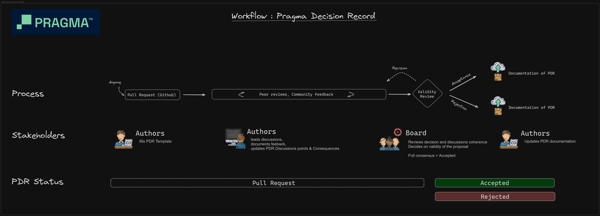

## Context
A Pragma Decision Record (PDR) is a formalised decision-making document for the Pragma organisation. A PDR describes a change within Pragma processes, a policy for maintainers, or a project guideline. In this PDR, we explain what a PDR is; the PDR workflow within Pragma current organisation; the role of the PDR Authors; and how users should go about proposing, discussing and structuring a PDR. 


PRAGMA as an open source organisation intends PDRs to be the primary mechanism for creating processes and managing the rules and the boundaries with its maintainers projects. PDRs are made to document discussions and community inputs towards reaching a decision. PDRs are text files with a versioned repository that will make available the progress of a decision and its discussion.

## Motivation : Why is this PDR necessary?
PDRs aim to address the need for various parties to discuss and agree on a common set of processes, rules and guidelines that embodies PRAGMA.
This PDR process proposes a simple form of governance linked to PRAGMA board members as decision makers.

All decisions made with the process described in this document applies only to PRAGMA and the projects within.

## Decision
PRAGMA will use this workflow to monitor and record all decisions regarding processes, policies & guidelines.

Decisions are recorded as numbered (over 4 digits, left-padded) markdown files, versioned directly with the project sources.

We currently recognise and record three types of decisions:

- `Process`: decisions related to the overall process that must be applied by the PRAGMA organisation.
- `Policy`: decisions that creates a rule that all lead maintainers must apply within their project environment
- `Guidelines`: decisions that formalise a best practice from a project as a recommendation

The main input for the decision pipeline is community-driven : we believe that decisions are the result of lively discussions on the most efficient ways of building things.

## Consequences

The items described below detail the workflow, the stakeholders, and the documentation required to run the process.

### Table of Contents
   * [Process](#process)
      + [1. Submitting a decision to PRAGMA](#1-submitting-a-decision-to-pragma)
         - [1.a. Authors open a pull request](#1a-authors-open-a-pull-request)
         - [1.b. Authors seek feedback](#1b-authors-seek-feedback)
      + [2. Validity review](#2-validity-review)
      + [Roles](#roles)
         - [Authors](#authors)
         - [Board members](#board-members)
   * [Document](#document)
      + [Header Preamble](#header-preamble)
      + [Categories](#categories)
      + [Statuses](#statuses)
         - [Status: Proposed](#status-proposed)
         - [Status: Accepted](#status-accepted)
         - [Status: Rejected](#status-rejected)
      + [Context](#context)
      + [Motivation](#motivation)
      + [Decision](#decision)
      + [Consequence](#consequence)
      + [Discussion points](#discussion-points)
   * [Structure related items](#structure-related-items)
      + [Repository Organization](#repository-organization)
      + [Versioning](#versioning)

### Process



#### 1. Submitting a decision to PRAGMA

##### 1.a. Authors open a pull request
Decision proposals must be submitted to the [pragma-org/PDRs][PullRequest] repository as a pull request named after the decision title. The pull request title **should not** include a PDR number (and use `?` instead as a number); the board members will assign one. 

##### Naming PDRs with similar subjects

When a PDR title *and* subject matter share a common element, begin the PDR title with that common element and end it with the specific portion delimited with the `-` character.  Example :

> *Web-Wallet Bridge **-** Governance*

Board members will help determine these common elements and, whenever necessary, rename both PDR document titles and PR titles accordingly.  The objective is to provide commonly recognisable names for similar developments (e.g., multiple extensions to another PDR or scheme).

##### Link to a decision from PR first comment

In the original comment for your pull request, please include a link to the directory or the `README.md` for the PDR in your working branch so readers and reviewers can easily follow your work. This makes it easier for board members and the community to read and review your proposal.

> [!IMPORTANT]
> If this link changes (e.g. from the PDR directory being renamed), please keep this link updated.

##### 1.b. Authors seek feedback

Authors shall champion their decision proposals. The PDR process is a collaborative effort, which implies discussions between different groups of individuals. While board members may provide specific inputs and help reach out to experts, authors shall be responsive to feedback and include relevant parties to the conversation when they see fit. The board may also request feedback from external parties to fuel the conversation.

Discussions and comments shall mainly happen on Github in pull requests. When discussed on other mediums, we expect authors or participants to report back a summary of their discussions to the original pull request to keep track of the most critical conversations in a written form and all in one place.

As much as possible, commenters/reviewers shall remain unbiased in their judgement and assess decisions in good faith. Authors have the right to reject comments or feedback but **are strongly encouraged to address concerns in their 'Consequence' and 'Discussion Points' sections**. Ultimately, PRAGMA board members shall make the last call concerning the various statements made on a decision and their treatment by the author(s).

By opening pull requests or posting comments, commenters and authors agree to our [Code of Conduct][CoC]. Any comment infringing this code of conduct shall be removed or altered without prior notice.

#### 2. Validity review

On a monthly basis, PRAGMA board members will review in more some chosen PDRs (based on their readiness and the stability of the discussions) and assess if they meet the criteria to be merged in their aimed status.

During review sessions, board members will regularly invite project maintainers or actors from the ecosystem who are deemed relevant to the meeting's agenda.

A dedicated [Discord][Discord] thread may also be created for some long-running discussions to support quick chats and progress on particular topics (while still being regularly summarised on the repository).

The outcome of that review can be the following :
- Acceptance : The decision is accepted by the board and is now part of PRAGMA; status becomes _'Accepted'_
- Rejection : The decision is rejected by the board the reasons behind rejection are documented in the PDR section _'Discussion points'_; status becomes _'Rejected'_
- Incomplete : The decision is not documented enough to reach an agreement, another review is scheduled


#### Roles

##### Authors

###### Missions

Authors are people that deemed necessary to transform a discussion they were having into a decision for PRAGMA.

They are expected to lead discussions towards being accepted or rejected by the board.

People that intend to propose decisions in the PDR process must explicitly enlist themselves and commit to the following:
- a) allocating time to **review** proposals from actors of the community when solicited by board members (i.e., after one first round of reviews);
- b) defining additional rules and processes whereby external actors can engage with their project as part of the PDR process;

###### Nomination

Authors of a PDR can be anyone from the community, and there's no limit to the number of authors a PDR can have.

A common sense rule is that in the list of authors should be the main contributors to the discussion and the people that can commit to review the decision with the PRAGMA board members.

##### Board members

###### Missions

PRAGMA board members safeguard the PDR process: they form a group enforcing the process described in this document and facilitating conversations between community actors. Board members should strive to keep up to date with general discussions around Cardano. For each new draft proposal submitted on [pragma-org/PDRs][PullRequest] a board member might review it as follows:

- Read the decision decisions to check if it is ready, sound, and complete.
- Check if it has been [properly formatted](#structure).
- Check if sufficient time has been allowed for proper discussion amongst the community.
- Ensure the motivation behind the PDR is valid and that design choices have relevant justifications or rationale.
- Assign a PDR number
- Request wording/grammar adjustments

PDRs that do not meet a sufficient level of quality or don't abide by the process described in this document will be deemed _'Incomplete'_ until their authors address review comments.

###### Reviews

Note that board members **may** sometimes provide specific feedback on decisions, although they aren't expected to be the sole technical reviewers of decisions. PDRs are, before anything, a community-driven effort. While board members are here to facilitate the discussion and mediate debates, they aren't necessarily technical experts on all subjects covered by PDRs.

Therefore, PDRs authors are encouraged to reach out to known experts to demonstrate their good faith and openness when they champion a decision. Board members may help with such efforts but cannot be expected to do this alone.

###### Nomination

The PRAGMA board members are chosen by General Assembly (of the 5 founding members of PRAGMA) for a duration of 4 years and cannot be elected for more than 3 terms as described in the statutes of PRAGMA. They perform their work on a voluntary basis.


Current board members are listed here below:

| Christina Gianelloni <br/> [@musik-c][] | Christian Grobmeier <br/> [@grobmeier][] |Daniel Gonzalez <br/> [@gonzalaga][] |  Federico Weill <br/> [@federicoweill][] | Sebastian Bode <br/> [@cleanerm5][] |
| ---                               | ---                                           | ---                            | ---                            | ---                             |

[@musik-c]: https://github.com/musik-c
[@grobmeier]: https://github.com/grobmeier
[@federicoweill]: https://github.com/federicoweill
[@gonzalaga]: https://github.com/gonzalaga
[@cleanerm5]: https://github.com/cleanerm5

### Document

A PDR is, first and foremost, a document which proposes a decision resulting from a discussion that is ongoing on a specific topic. Documents are [Markdown][] files with a _Preamble_ and a set of pre-defined sections.

PDR authors must abide by the general structure, though they are free to organise each section as they see fit.

The structure of a PDR file is summarised in the table below:

Name                                            | Description
---                                             | ---
Preamble                                        | Headers containing metadata about the PDR ([see below](#header-preamble)).
Context                                         | A short (\~200 word) description of the context, explaination of the discussions where the decision came from.
Motivation                                      | A clear explanation of "Why it's necessary to make that decision" introducing the purpose of the decision.
Decision                                        | Clarify the content of the decision by explaining its scope of application with sufficient details to be self-explanatory.
Consequences                                    | Describe the result/consequences of applying that decision; both positive and negative outcomes <br/> If the decisions is a *Policy*, elaborate in that section on how to measure the application of the policy on a project (qualitative or quantitative) by using metrics that can be understood by any internet user.
Discussion points                               | Summarizes, a posteriori, the major discussion points that gravitates around the decision
_optional sections_                             | May appear in any order, or with custom titles, at author and board members discretion:<br/>**Versioning**: to point out majors changes<br/>**References**<br/>**Appendices**<br/>**Acknowledgements**

> [!NOTE]
> Each of these section titles (*Abstract* onward) should be an H2 heading (beginning with markdown `##`). Subsections like _Positive outcomes_ or _Negative outcomes_ should be H3 headings (e.g. `### Positive outcomes`).  Don't include a H1 title heading (markdown `#`): for web friendly contexts, this will be generated from the Preamble.

#### Header Preamble

Each PDR must begin with a YAML key:value style header preamble (also known as _front matter data_), preceded and followed by three hyphens (`---`).

Field              | Description
---                | ---
`PDR`              | The PDR number (without leading 0), as assigned by GitHub on the initial pull request.
`Title`            | A succinct and descriptive title.  If necessary, use a `-` delimiter to begin with an applicable classification (see [Naming PDRs with similar subjects](#naming-PDRs-with-similar-subjects)).
`Category`         | One of the registered [categories](#categories).
`Status`           | Accepted \| Rejected (.._reason_..)
`Authors`          | A list of authors' real names and email addresses (e.g. John Doe <john.doe@email.domain>)
`Created`          | Date created on, in ISO 8601 (YYYY-MM-DD) format

For example:

```yaml
---
PDR: 1
Title: PRAGMA Decision Record Process
Status: Proposed
Category: Process
Created: 2024-05-24
Authors :
    - Damien Czapla <damien.czapla@openthelead.com>
    - Christina Gianelloni <christina@blinklabs.io>
    - Christian Grobmeier <cg@grobmeier.de>
    - Daniel Gonzalez <dan@sundaeswap.finance>
    - Federico Weill <federico@txpipe.io>
    - Sebastian Bode <sebastian.bode@cardanofoundation.org>
---
```

> [!TIP]
> A reference template is available in [.github/PDR-Template.md][PDR-Template.md]

#### Categories

PDRs are classified into distinct categories that help organise (and thus, find) them. Categories are meant to be flexible and evolve as new domains emerge. Authors may leave the category as `?` should they not be sure under which category their decision falls; board members will eventually assign one or reject the proposal altogether should it relate to an area where the PDR process does not apply.

At present, we consider the following list of initial categories:

Category   | Description
---        | ---
Process    | Creates a new way of working within PRAGMA
Policy     | Creates a rule that all PRAGMA maintainers must abide by
Guidelines | Recommendations of best practices for PRAGMA maintainers

#### Statuses

PDRs can have two statuses: `Accepted` or `Rejected`. [The PDR Process section](#process) highlights how PDRs move through these statuses; no PDR should be given one of these statuses without satisfying the criteria described here below.


> [!NOTE]
> There is no "draft" status: a decisions which has not been merged (and hence exists in a PR) is a draft PDR.

##### Status: Accepted

A _'Accepted'_ PDR is any PDR that meets the essential PDR criteria and has been approved by the board. The criteria that must meet a PDR to be merged as _'Accepted'_ are:

- It must contain all the sections described in [Structure](#structure).
- The quality of the content must be to the Board satisfaction. That means it must be grammatically sound, well-articulated, and demonstrate noticeable effort in terms of completeness and level of detail.
- Its technical soundness should have been established. Where necessary, this may require review by particular experts and addressing their concerns. Note that the requirement is that the proposal makes sense (i.e., be technically sound), yet no consulted experts need to think it is a good idea.
- It must have a valid [Consequence](#consequence) section as defined below.

Furthermore, to criteria for being accepted may vary depending on the nature of the PDR, typically:

- For PDRs that relate to policies for projects, it becomes _'Accepted'_ by formalising in the consequences of what applying the policy means and also by having a way to measure the application of the policy on project;
- For guidelines, a PDR becomes _'Accepted'_ by having enough evidences to prove that the decisions is being used and is recognized as a standard in the ecosystem;
- For process, it means having a _'Motivation'_ that targets PRAGMA as a whole and provides added value to be used.

A decision that is _'Accepted'_ is considered complete and is synonymous with "production readiness" when it comes to the maturity of a solution. _'Accepted'_ PDRs will not be updated substantially (apart from minor edits, proofreading, and added precisions). They can, nevertheless, be challenged through new decisions if need be.

##### Status: Rejected

A _'Rejected'_ PDR describes any decision that does not fit into the other types. A PDR can therefore be _'Rejected'_ for various reasons (e.g., obsolete, superseded, abandoned). Hence, the status must indicate a justification in brackets; for example:

```
Status: Rejected (superseded by PDR-0001)
```

#### Context

Formalises the origin of the decision (usually discussions), and mentions the time and place of the discussions that led to the creation of the PDR.

#### Motivation

Arguments an answer to "Why it's necessary to make that decision" for PRAGMA. Pointing forward what purpose does that PDR encapsulates.

#### Decision

Clarifies the implementation of the decision and its scope of application.

#### Consequence

Formalises the consequences to the existing environment of PRAGMA.

This must be subdivided into two sub-sections:

  - _'Positive outcomes'_

    This sub-section must define a list of outcomes that are identified as positive during the discussions happening around the decision. Items of this section must relate to observable metrics, facts, or deliverables and can be double-checked with other project maintainers when applicable. For example: "Reduces dependency on centralized platforms like GitHub", or "Encourages a low-tech approach to contributions, potentially increasing accessibility for some contributors".

  - _'Negative outcomes'_

    This sub-section must define a list of outcomes that are identified as negative during the discussions happening around the decision. Criteria must relate to observable metrics, facts or deliverables and can be reviewed by other project maintainers when applicable. For example: "Increased overhead for contributors to manage patches and communicate through mailing lists", or "Higher barrier to entry for new contributors unfamiliar with the proposed decentralized tools and processes".

> [!NOTE]
> The status `Accepted` requires a _Consequence_ section, making this a _required_ section for all viable decisions.  Even if a PDR is `Rejected`, it will be interesting to document the `Consequence` that lead to that decision.

#### Discussion points

Summarizes the main arguments pointed forward while discussing the decision.

### Structure related items

#### Repository Organization

A PDR must be stored in a specific folder named after its number (4-digit, left-padded with `0`) and in a file called `README.md`.


Additional supporting files (such as diagrams, binary specifications, dialect grammars, JSON schemas etc.) may be added to the PDR's folder under freely chosen names.

For example:

```
PDR-0010
├── README.md
├── registry.json
└── registry.schema.json

```

#### Language

PDRs must be written in English.

#### Versioning

Accepted PDRs are final in their content. Any subsantial change must go through another PDR. A previously accepted PDR may be superseded by a new one and its status changed to `Rejected`.

## Discussions points

- The CIP (Cardano Improvement Proposal) & EIP (Ethereum Improvement Proposal) process designed for a large, well-established community with many subsystems and contributors can be a knowledgable source of inspiration.
- Given the open source nature of PRAGMA and its projects, everything described in the PDR Process should be self explanatory.
- ADR (Architecture Decision Record) tracks and explains critical architectural decisions, this can be adapted to drive the documentation of the decision making process related to PRAGMA.

[PDR-TEMPLATE.md]: https://github.com/pragma-org/PDRs/blob/main/.github/PDR-TEMPLATE.md
[Markdown]: https://en.wikipedia.org/wiki/Markdown
[PullRequest]: https://github.com/pragma-org/PDRs/pulls
[CoC]: https://github.com/pragma-org/PDRs/blob/main/CODE_OF_CONDUCT.md
[Discord]: https://discord.gg/fUyPWjBcKE
